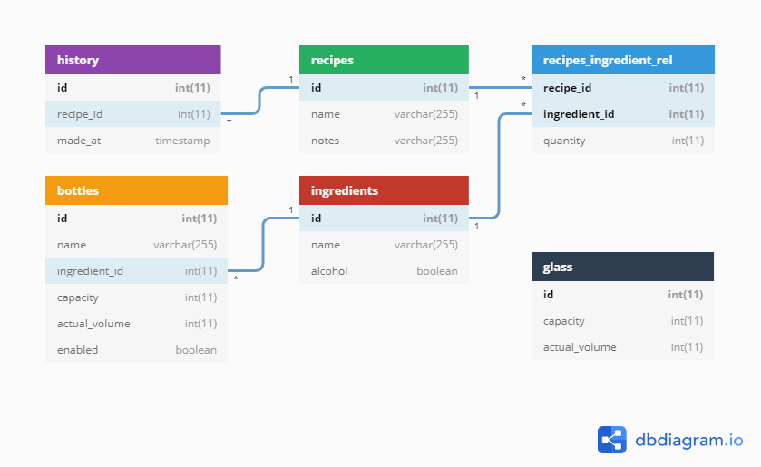

# Mixologist

Cocktail machine project for Ambiant Intelligence class @ Instituto Superior Técnico, Lisbon, Portugal.

More information: [https://fenix.tecnico.ulisboa.pt/disciplinas/AI514/2019-2020/2-semestre](https://fenix.tecnico.ulisboa.pt/disciplinas/AI514/2019-2020/2-semestre)

*Group 10*

## Features

## TODO
- Add HTTPS layer
- Add Python env
- Add hardware interface

## Specifications

### Database specification

## Prerequisites

- Python 3
- flask, pymysql, flask-socketio, gevent, gevent-websocket
- MySQL/MariaDB

## How to build

Replace db settings in Database.py

## Valuable resources:

- https://sweetcode.io/flask-python-3-mysql/
- https://www.diffordsguide.com/encyclopedia/1045/cocktails/top-100-most-frequently-appearing-cocktail-ingredients